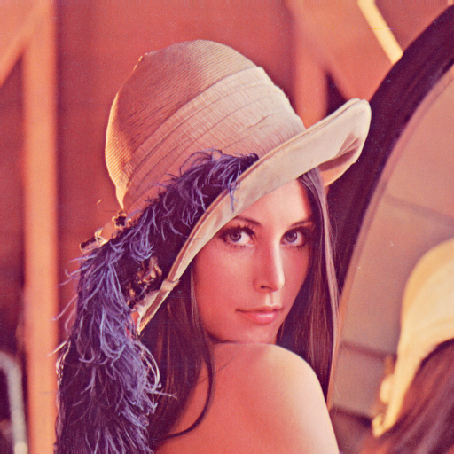
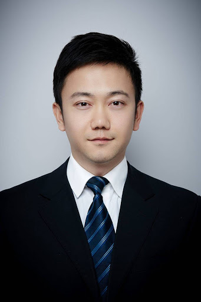
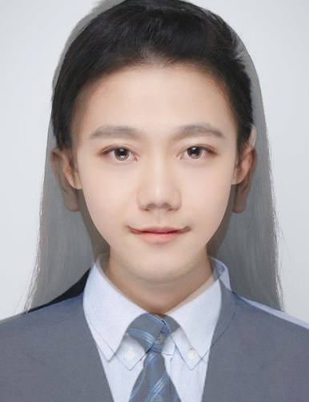
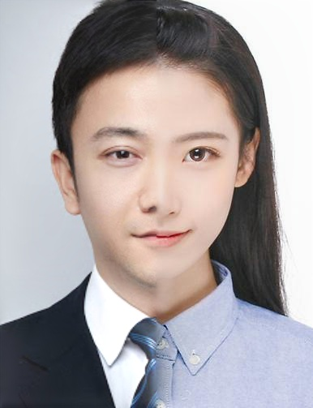
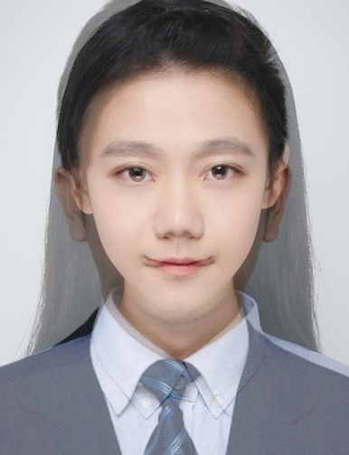
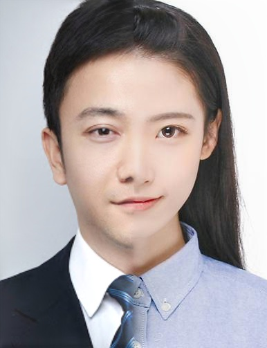
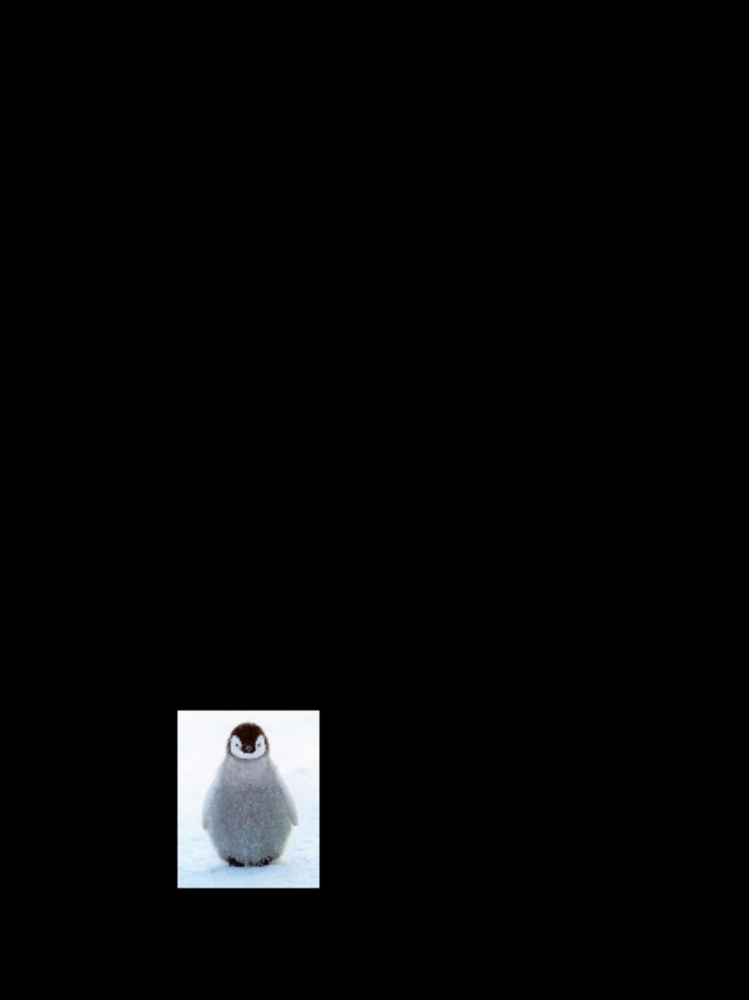
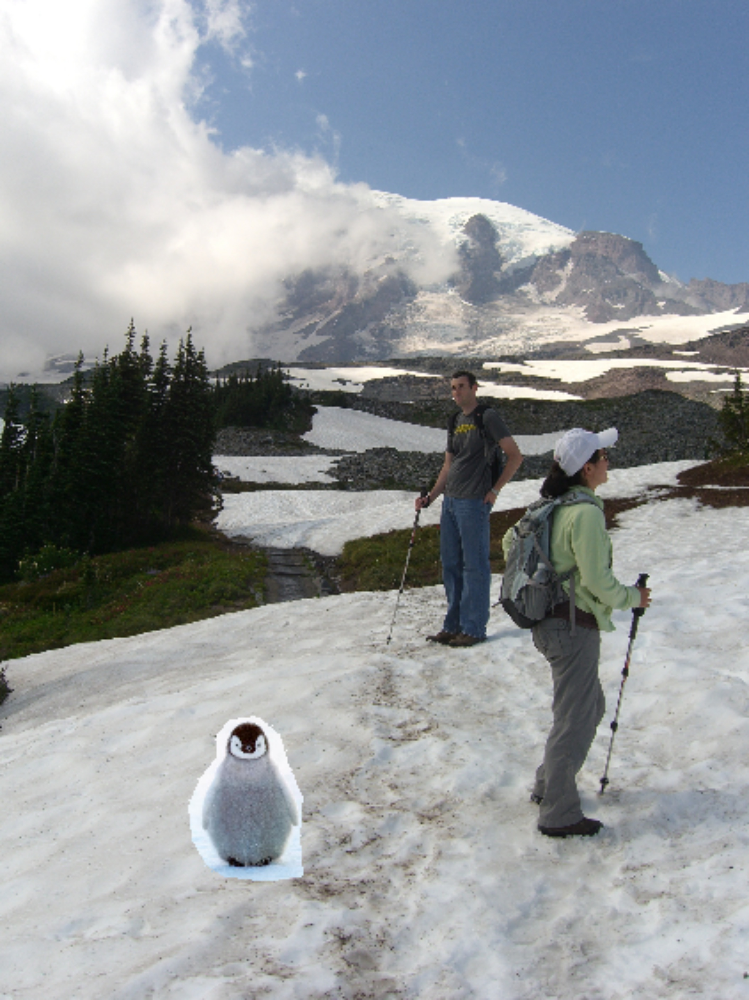
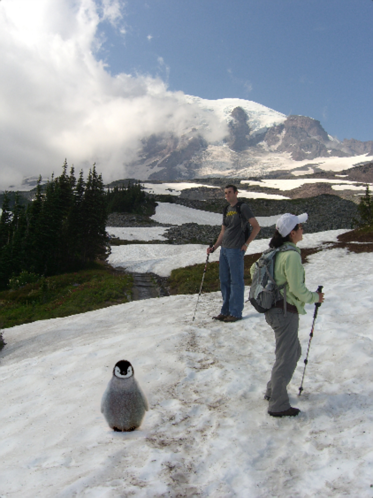

### CS270 Homework 2 Report

任怡静 2018533144

#### Question 1 Image Compression and Watermarking

- How do you implement your algorithm? Describe it by flow charts or words. (6 pts)
  - **Truncated Huffman Compression**
    - For Picture -> Code encryption (**Compression**): 
      - First I cut the image into $8*8$ blocks, do **DCT** operation on each block, divide it by the **Y_TABLE** provided, flatten them in **zig-zag** fashion and **cut out** all the zeros in the tail (that is to say if a zigzag array is: [40 0 2 3 0 1 0 0 0 0 ...], I only keep the [40 0 2 3 0 1] part)
      - Then I **collect all the symbols** in the truncated zigzagged arrays mentioned above, and also add an **'EOF'** (in program is 'E') symbol at each end of the arrays. Count all symbols' probabilities, and **construct Huffman dictionary** from these probabilities.
      - Encode the codes in this fashion:
        - **DC_CODES**: Extract the first element in each zigzagged array (The DC values), and transfer them into **8-bit binary form**
        - **AC_CODES**: Connected the rest in zigzagged array by translating each value in the array to the Huffman binary code, and add the 'E' 's Huffman binary code at each end of an array, connect all pieces together
        - Connect the above two pieces as: **DC_CODES** + **AC_CODES**
    - For Code -> Picture decryption (**Display**) :
      - First cut out the $[0:8 * 64 * 64]$ part of the binary code and decode them by cutting each 8 of them and transfer them into **decimal numbers**, fill them in the **first place** in a 1D array.
      - Then decode the rest consulting to the Huffman code dictionary, also fill them in the 1D array
      - Fill in array with zeros in the back **until the array has size 64**, then de-Zigzag it and put them in place.
      - Time each de-zigzagged block with **Y_TABLE**, apply **IDCT** operation to them, and combine the blocks into restored image.
  - **Image Watermarking**
    - For encrypting watermark to image:
      - The encrypting process is quite similar to the image compression process until truncating zigzagged arrays. I also cut the picture into $8*8$ blocks, do **DCT**, divide by Y_TABLE
      - And then I check for non-zero AC values in the **qDCT** blocks (the blocks that did **DCT** and divided by **Y_TABLE**), replace the value $q_k$ at that position by  $q_{k(i,j,s,t)} = q_{k(i,j,s,t)} * (1 + \alpha * w_k)$, find $k$ values then stop ($k$ is the length of the flatten size of watermark)
      - Rebuild the picture by timing the Y_TABLE, apply **IDCT** operation and combine them.
      - For better result, I **cut out the white spaces** in LOGO_CS270.mat making it smaller, then restore it by **filling 255** in the cut areas.
      - Also for better result, I did some **erosions and dilations** to the extracted image.

- Results requested in Task (1). (14 pts) 

  - Left Original, right Compressed

    <figure class="half">
        
    </figure>

- Results of watermarking extracted from the compressed image. (14 pts)

#### Question 2 Image Blending

- **Pyramid-Based Image Blending** 

  - There are two versions of registrations, one is by reading two .mat feature files that contains man's and girl's feature and use code to match them, it performs well in blending chins. Another one uses a pre-defined matrix to do the transform, which do better in mouths and skins.

  - I think the pre-defined version is better

    <figure class="half">
        
    </figure>

- **Poisson-Based Image Blending**

  <figure class="half">
      
  </figure>

#### Question 3 Image Deblurring

- How do you implement your algorithm? Describe it by flow charts or words. (6 pts)

  - Explain transformation steps:

    - lαβ space's axes has rare correlations, thus transforming in lαβ space is safer than in RGB space
    - First transformation transform the RGB color space to LMS color space using specified matrices
    - The second transformation is to take the log values of LMS color space and transform it to lαβ space using specified matrices
    - Then the color correction:
      - First extract the "special" parts of the **source** image (doing this by subtracting each color axes in lαβ by each mean value in **source**), so that the shapes in **source** is reserved.
      - Transform each color axes in lαβ by timing the ratio of lαβ of **target** and lαβ of **source**. By doing this, the "special" parts of **source** has been transformed into the style of **target**
      - Add the mean value in **target** of lαβ axes to each color axis, at this time the new picture will contains the "special" parts of **source** and the color style of **target**
    - Then use the inverse specified matrix operation to revert to LMS, then RGB space to recover the new image in RGB space.

  - Coding implementation

    - For RGB transform lαβ space:

      - Step 1: initialize the following matrices

      - $$
        rgb2xyz = \left[ \matrix{ 0.5141 & 0.3239 & 0.1604\\   0.2651 & 0.6702 & 0.0641\\  0.0241 & 0.1288 & 0.8444  } \right] \\
        xyz2lms = \left[ \matrix{ 0.3897 & 0.6890 & -0.0787\\  -0.2298 & 1.1834 & 0.0464\\  0.0000 & 0.0000 & 1.0000  } \right]\\
        lms2lab \_1 = \left[ \matrix{ \frac{1}{\sqrt{3}} & 0 & 0\\  0 & \frac{1}{\sqrt{6}} & 0\\  0 & 0 & \frac{1}{\sqrt{2}} } \right]\\
        lms2lab \_2 = \left[ \matrix{ 1 & 1 & 1\\  1 & 1 & -2\\  1 & -1 & 0  } \right]\\
        $$

      - Step 2: Iterate through all the 1*3 RGB vectors at each position of the picture. Calculate the vector **temp** = xyz2lms * (rgb2xyz * rgb), and if one of the vector **temp** is 0, assign 0 to that dimension rather than assign it with log10(**temp(s)**)

    - For  Color Correction:

      - The inputs are: **input**, **reference**, and they are both lαβ space matrices, and **input** indicates **source**, **reference** indicates **target**
      - Step 1: First calculate the mean and deviation of three channels (l, α, β) for **input** and **reference**, mark them as L_bar, A_bar, B_bar, L_sdev, A_sdev, B_sdev; L_tbar, A_tbar, B_tbar, L_tdev, A_tdev, B_tdev
      - Step 2: For each layer of lαβ, calculate each positions' value **correction(row,col,lαβ)** = (L_tdev/L_sdev) .* (lαβ(i,j) - L_bar) + L_tbar;
      - Step 3: After the loop, return the **correction** as output.

    - For lαβ transform RGB space:

      - Step 1: initialize the following matrices

      - $$
        lms2rgb = \left[ \matrix{ 4.4679 & -3.5873 & 0.1193\\   -1.2186 & 2.3809 & -0.1624\\  0.0497 & -0.2439 & 1.2045  } \right] \\
        lms2lab \_1 = \left[ \matrix{ \frac{1}{\sqrt{3}} & 0 & 0\\  0 & \frac{1}{\sqrt{6}} & 0\\  0 & 0 & \frac{1}{\sqrt{2}} } \right]\\
        lms2lab \_2 = \left[ \matrix{ 1 & 1 & 1\\  1 & 1 & -2\\  1 & -1 & 0  } \right]\\
        $$

      - Step 2: Iterate through all the 1*3 lαβ vectors at each position of the picture. Calculate the vector rgb(row, col, RGB) = lms2rgb * 10^(lms2lab_2 * lms2lab_1 * lαβ(row, col, lαβ)) for all positions and get the result of RGB picture matrix

- The improvements you made to the algorithm. (3 pts)

  - There is a small modification in dealing with **temp** being 0, in the documentation, the hint suggested to add a small value to 0s in input RGB vectors, but it will cause some errors in the picture, causing some place to have purple dots. A better way is to judge after calculation, that is to say, to check after doing **temp** = xyz2lms * (rgb2xyz * rgb), assign 0 directly rather than doing logarithm calculation, it can avoid errors of infinity and make the pictures looks better. (Transfer result)
  - The color transfer result seems satisfying, not too bright or dark

- LAB color space image (like Fig 9). (2*2 pts)

  - 

- Component image of LAB (like Fig 10). (2*2 pts)

  - 

- Result of your color transformation (like Fig 11). (2*2 pts)

  - 

- Result of your color transformation (like Fig 12). (2*2 pts)

  - 

- Your selected images and color transfer results (4 pts). 

  - 
  - Explanation
    - As we can see, the pictures (**source**) all changes to the color style of the other picture (**target**)
    - The **source** and **target** are all transformed to lαβ color space because there are barely correlation between the axes. Thus it is safer to do transform between two pictures and then revert **transformed source** back to RGB color space.
    - The main Idea is to find out the trait of the **source** picture and the color axes' value ratio between two pictures. The trait will leave the picture hold its shapes in place, and the ratio will adjust the **source** picture's color towards **target**. Thus the pictures(**source**) can transform to similar color style of other pictures(**target**).

