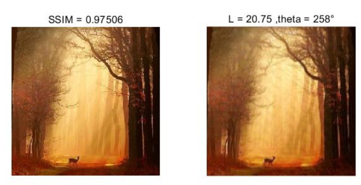
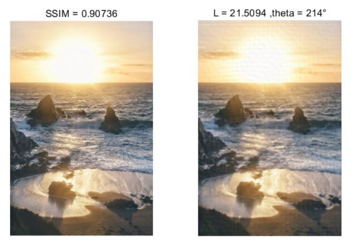
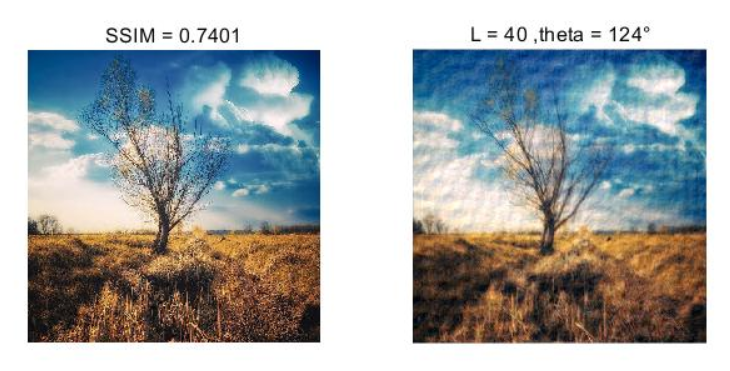
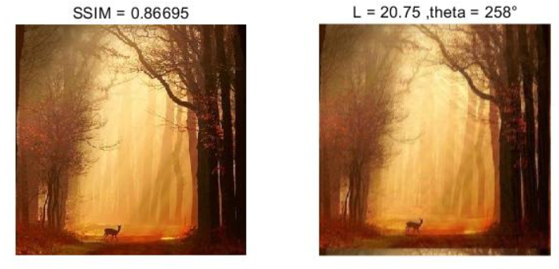
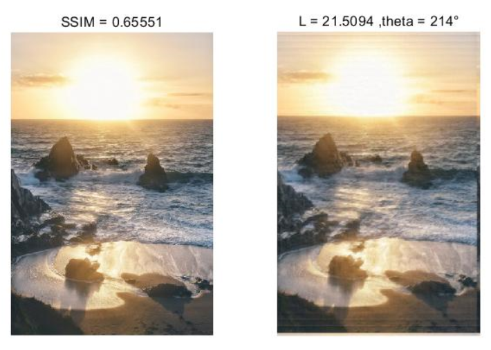
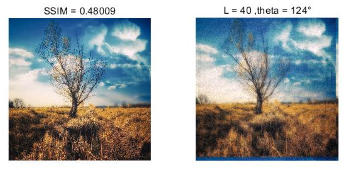

### CS270 Homework 2 Report

任怡静 2018533144

#### Question 1 Image Compression and Watermarking

- How do you implement your algorithm? Describe it by flow charts or words. (6 pts)
  - **Truncated Huffman Compression**
    - For Picture -> Code encryption (**Compression**): 
      - First I cut the image into $8*8$ blocks, do **DCT** operation on each block, divide it by the **Y_TABLE** provided, flatten them in **zig-zag** fashion and **cut out** all the zeros in the tail (that is to say if a zigzag array is: [40 0 2 3 0 1 0 0 0 0 ...], I only keep the [40 0 2 3 0 1] part)
      - Then I **collect all the symbols** in the truncated zigzagged arrays mentioned above, and also add an **'EOF'** (in program is 'E') symbol at each end of the arrays. Count all symbols' probabilities, and **construct Huffman dictionary** from these probabilities.
      - Encode the codes in this fashion:
        - **DC_CODES**: Extract the first element in each zigzagged array (The DC values), and transfer them into **8-bit binary form**
        - **AC_CODES**: Connected the rest in zigzagged array by translating each value in the array to the Huffman binary code, and add the 'E' 's Huffman binary code at each end of an array, connect all pieces together
        - Connect the above two pieces as: **DC_CODES** + **AC_CODES**
    - For Code -> Picture decryption (**Display**) :
      - First cut out the $[0:8 * 64 * 64]$ part of the binary code and decode them by cutting each 8 of them and transfer them into **decimal numbers**, fill them in the **first place** in a 1D array.
      - Then decode the rest consulting to the Huffman code dictionary, also fill them in the 1D array
      - Fill in array with zeros in the back **until the array has size 64**, then de-Zigzag it and put them in place.
      - Time each de-zigzagged block with **Y_TABLE**, apply **IDCT** operation to them, and combine the blocks into restored image.
  - **Image Watermarking**
    - For encrypting watermark to image:
      - The encrypting process is quite similar to the image compression process until truncating zigzagged arrays. I also cut the picture into $8*8$ blocks, do **DCT**, divide by Y_TABLE
      - And then I check for non-zero AC values in the **qDCT** blocks (the blocks that did **DCT** and divided by **Y_TABLE**), replace the value $q_k$ at that position by  $q_{k(i,j,s,t)} = q_{k(i,j,s,t)} * (1 + \alpha * w_k)$, find $k$ values then stop ($k$ is the length of the flatten size of watermark)
      - Rebuild the picture by timing the Y_TABLE, apply **IDCT** operation and combine them.
      - For better result, I **cut out the white spaces** in LOGO_CS270.mat making it smaller, then restore it by **filling 255** in the cut areas.
      - Also for better result, I did some **erosions and dilations** to the extracted image.

- Results requested in Task (1). (14 pts) 

  - Left Original, right Compressed

    <figure class="half">
        
    </figure>

- Results of watermarking extracted from the compressed image. (14 pts)

#### Question 2 Image Blending

- **Pyramid-Based Image Blending** 

  - There are two versions of registrations, one is by reading two .mat feature files that contains man's and girl's feature and use code to match them, it performs well in blending chins. Another one uses a pre-defined matrix to do the transform, which do better in mouths and skins.

  - I think the pre-defined version is better

    <figure class="half">
        
    </figure>

    <figure class="half">
        
    </figure>

- **Poisson-Based Image Blending**

  <figure class="half">
      
  </figure>

#### Question 3 Image Deblurring

- How do you implement your algorithm? Describe it by flow charts or words. (6 pts)

  - I first transform the image into **square shape** using resize function, then do FFT and some post process to get a picture with clear stripes.
  - Estimate $\theta$ with **Hough transform**, and estimate $L$ with the projected plot of the rotated stripe figure (stripes perpendicular to horizontal line)
  - Reconstruct the blur matrix by `fspecial('motion',L,theta)`, then use **weiner** or **CLS** filter to deblur the image

- Describe implement details of your code. (6 pts)

  - For **DetectMotionParameters**:

    - As described above, I did **FFT** for the **squared image** and get the clear stripes image following these steps:
      - First do $fft\_image_{(i,j)}=15*log(abs(fft\_image_{(i,j)}))$
      - Then **binarize** the image, use **morph** to close up disconnected short lines and cut out connected lines that are not supposed to be connected.
      - Use **edge detection** to check for the stripes we need
      - Use **Hough** transform to find lines' $\theta$ = 180 - hough_theta
      - Rotate the image by $\theta$ to get the stripes perpendicular to horizontal, then project it to get the plot, and estimate $L=N/d$ with the highest hill.
  - For **Weiner Filter**:
    - In a word, the Weiner filter follows the following calculation in frequency domain 
    - where $\frac{1}{SNR(f)}$ is $\frac{noise\ constant}{VAR(blurred \ image)}$, $H(f)$ is the estimated blur matrix in frequency domain
    - $\hat{X}(f) = G(f) * Y(f)$, where $Y(f)$ is the blurred image in frequency domain, and $\hat{X}(f)$ is the recovered image in frequency domain, recover $\hat{x}(f)$ by using **abs(IFFT)**
  - For **Constraint Least Square Filter**:
    - In a word, the Weiner filter follows the following calculation in frequency domain 
    - where $P = \left[ \matrix{ 0& -1& 0\\   -1& 4& -1\\  0& -1& 0} \right]$, $H$ is the estimated blur matrix in frequency.
    - $\hat{F}$ is the recovered image in frequency domain, recover $\hat{f}$ by using **IFFT**

- The parameters L and theta that you get from each figure.(3*2pts)

  - The first $L = 20.75,\theta = 258$ 
  - The second $L = 21.5094,\theta = 214$ 
  - The third $L = 40,\theta = 124$ 

- Your selected filtering method and the recovered images, as well as the Structural Similarity (SSIM) of the restored image and the original image . (3*4pts)

  - For picture 1, I select Constrained Least Square method since it over-performs the Weiner filter (first CLS, second Weiner, original on the left, recovered on the right)

    <figure class="half">
        
    </figure>

  - For picture 2, I select Constrained Least Square method since it over-performs the Weiner filter (first CLS, second Weiner,original on the left, recovered on the right)

    <figure class="half">
        
    </figure>

  - For picture 3, I select Constrained Least Square method since it over-performs the Weiner filter (first CLS, second Weiner,original on the left, recovered on the right)

    <figure class="half">
        
    </figure>

